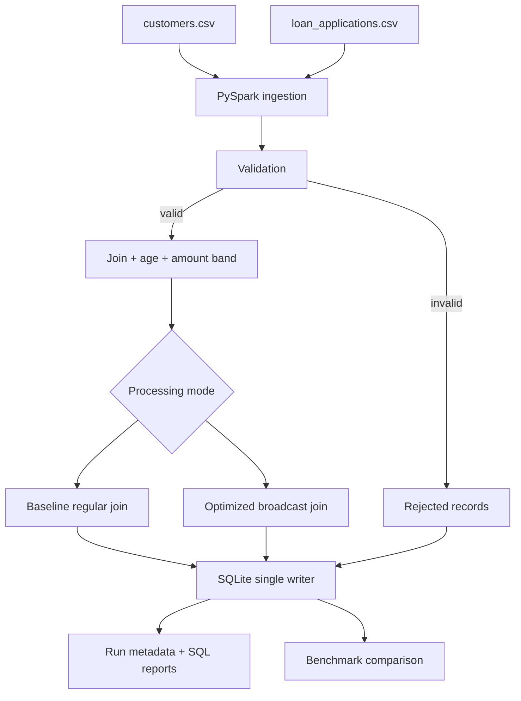

# Architecture

```mermaid
flowchart TD
  A[customers.csv] --> C[PySpark ingestion]
  B[loan_applications.csv] --> C
  C --> D[Validation]
  D -->|valid| E[Join + age + amount band]
  D -->|invalid| F[Rejected records]
  E --> G{Processing mode}
  G --> H[Baseline regular join]
  G --> I[Optimized broadcast join]
  H --> J[SQLite single writer]
  I --> J
  F --> J
  J --> K[Run metadata + SQL reports]
  J --> L[Benchmark comparison]
```

Spark performs distributed-style DataFrame transformations locally. SQLite is the persistent relational target and is written by one controlled Python process.
